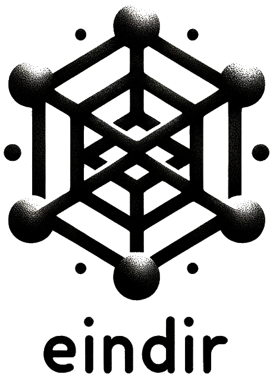

# eindir [](https://zenodo.org/doi/10.5281/zenodo.10672737)


A set of "particles" or components mainly focused on working with functions in ND.

## Development

We use `towncrier` for managing newsworthy contributions.
Also the easiest development environment is probably with `pixi` and `hatch`:

``` sh
pixi shell
pdm install
```

Now we have certain commands to help with development:

``` sh
pdm run lint
pdm run mkdoc
```

## License
MIT

## Relation to anneal

eindir supplies the Objective trait, Bounds, low-discrepancy generators (Halton, etc.), GLE thermostat matrices, surrogate primitives (AdditiveSurrogate, Chebyshev, ReducedObjective), and an optional `autodiff` feature (`num-dual` forward mode).
These primitives let anneal and downstream codes stay inside the typed five-component algebra and share one implementation of each slot.

**User entry for optimization:** start with [anneal](https://github.com/HaoZeke/anneal) (`pip install anneal`), the budget-only `global_optimize` API, the notebook `examples/notebooks/01_quickstart.ipynb`, and https://anneal.rgoswami.me — not the eindir trait surface.

Project history: continuous development since **2023-02**. Paper reproducibility: [anneal_repro](https://github.com/HaoZeke/anneal_repro), Zenodo [10.5281/zenodo.20672621](https://doi.org/10.5281/zenodo.20672621).
