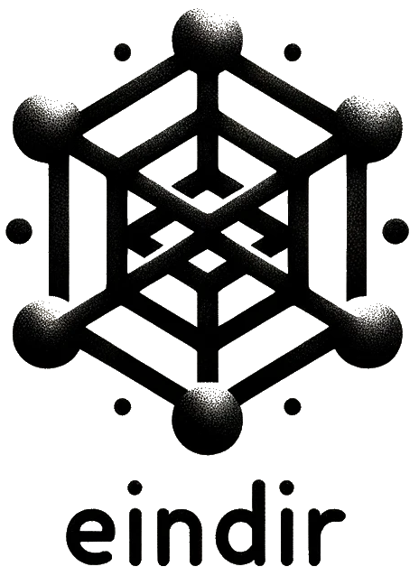

# eindir [](https://zenodo.org/doi/10.5281/zenodo.10672737)


A set of "particles" or components mainly focused on working with functions in ND.

## Development

We use `towncrier` for managing newsworthy contributions. Also the easiest
development environment is probably with `pixi` and `hatch`:

``` sh
pixi shell
pdm install
```

Now we have certain commands to help with development:

``` sh
pdm run lint
pdm run mkdoc
```

## License
MIT
